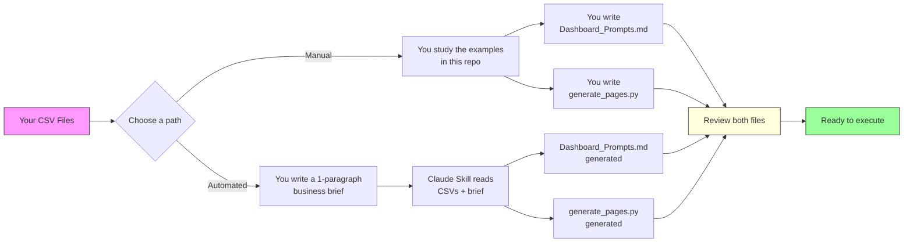
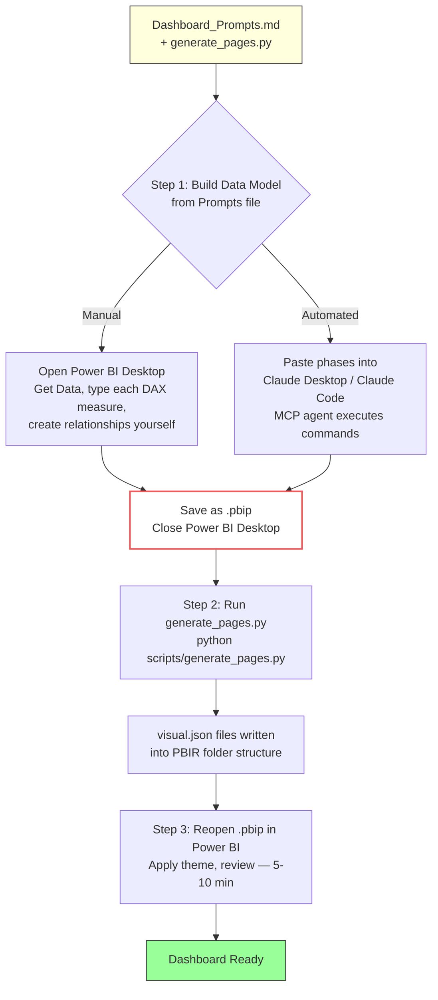
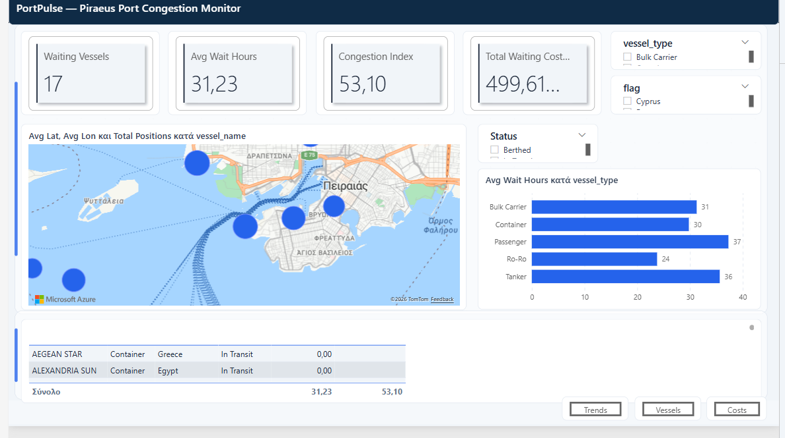
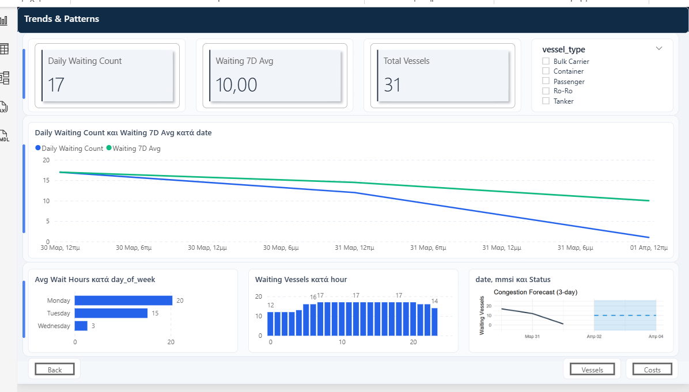
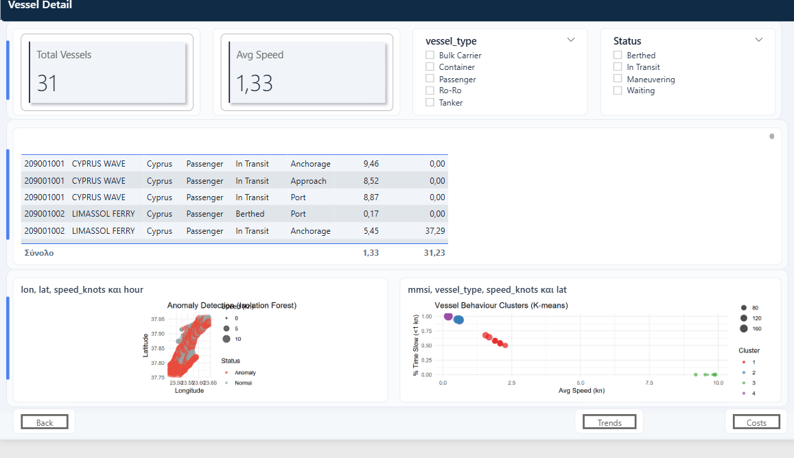
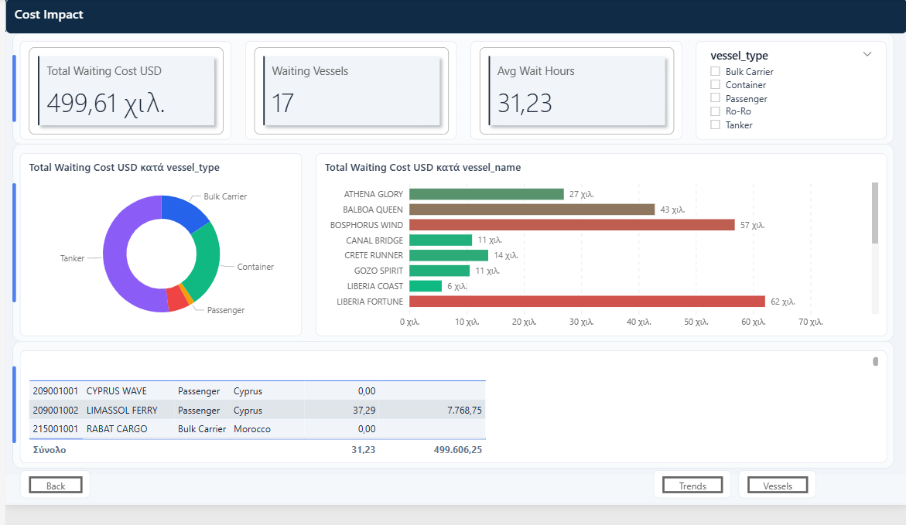
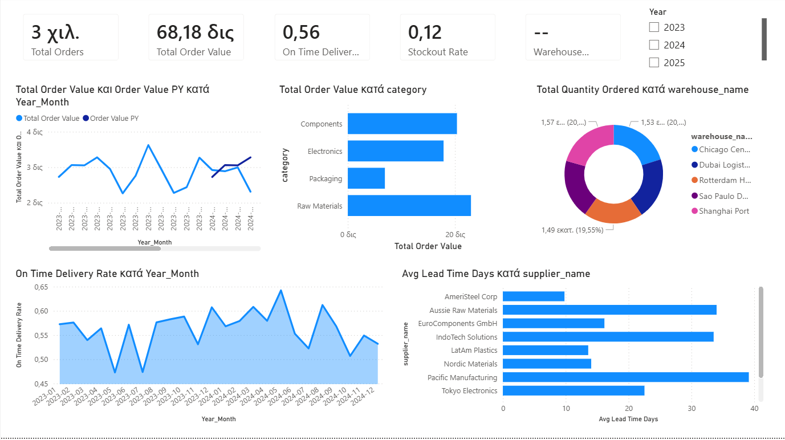
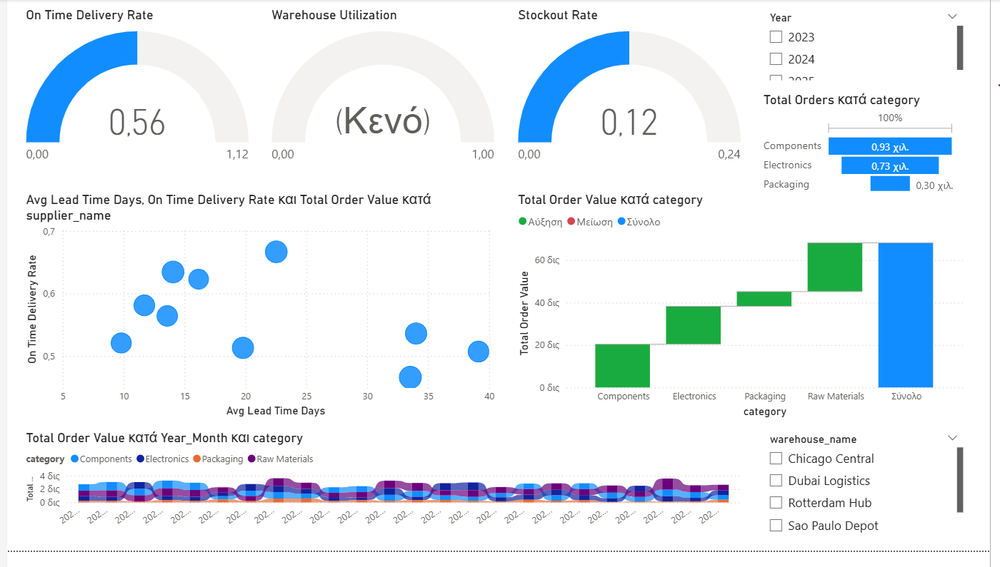
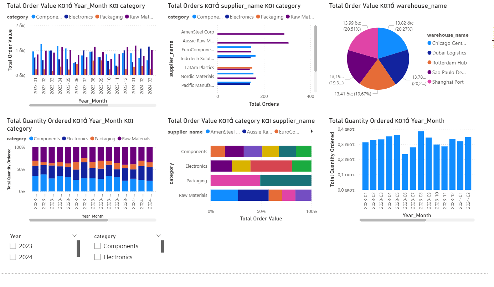

# Power BI Dashboards from Code — Zero Manual UI Work


Python scripts generate PBIR JSON files that Power BI renders as complete, multi-page dashboards. No dragging fields, no clicking through menus — one line of Python per visual.

## What You Need

The entire approach rests on **two text files** that together define a complete dashboard:

**1. `*_Dashboard_Prompts.md`** — The data model specification. This file describes everything about the data layer: which CSVs to load, column data types, table relationships, a Calendar table, and all DAX measures organized in phases. Think of it as a recipe that, when followed step by step in Power BI Desktop (or by an MCP agent), produces a fully wired-up data model. It does not generate any visuals — only the model that visuals will query.

**2. `scripts/generate_pages.py`** — The visual layout script. Pure Python (no dependencies beyond stdlib). When you run it, it writes `visual.json` files into the PBIR folder structure of your `.pbip` project. Each file defines one visual: its type, position on the canvas, size, data bindings, and formatting (accent bars on cards, styled table headers, clean chart gridlines, data labels). The visuals are designed to look professional on first open, not like a raw data dump.

**Where do these files come from?** Write them yourself or have Claude generate them — or mix and match. See [Getting Started](#getting-started) below.

## Diagram 1 — Getting the Two Files

You need a Prompts file (data model spec) and a generate_pages.py (visual layout script). Two ways to get them:



These paths can also be mixed — for example, generate the Prompts file with Claude (to get all the DAX written for you) but write the Python script yourself to control the exact page layout, or vice versa.

The Prompts file is always a human-reviewable checkpoint. Whether you wrote it or Claude generated it, you can read every DAX measure and relationship before anything touches Power BI.

## Diagram 2 — Executing the Pipeline

Once you have both files, execution has three steps. The only real choice is how you build the data model (Step 1).



A third option for Step 1 is TMDL / Tabular Editor — export or write TMDL files and deploy them to the Power BI project, skipping the Desktop UI entirely.

Power BI Desktop must be **closed** when you run generate_pages.py — it locks the PBIR files. The red-bordered "Save and close" step is the critical handoff between the Power BI UI and the Python script.

## How It Works

The two diagrams above show the full picture. In short: get the two files (Diagram 1), then execute them (Diagram 2). The execution pipeline always has the same three steps regardless of which path you took to get the files:

1. **Build the data model** from the Prompts file — load CSVs, create relationships, add DAX measures. Do this manually in Power BI Desktop or via an MCP agent. Save as `.pbip`.
2. **Run generate_pages.py** (with Power BI closed) — the script writes `visual.json` files into the PBIR folder structure.
3. **Reopen the `.pbip`** — all pages appear with formatted, data-bound visuals. Apply a theme for global color consistency, review titles and layout (5–10 min).

The two Options below walk through each path end-to-end with specific steps.

## Getting Started

### Prerequisites

Both options require:

- **Power BI Desktop** (Windows) with PBIR preview features enabled: File > Options > Preview features, then enable: *Store reports using enhanced metadata format (PBIR)*, *Power BI Project (.pbip) save option*, *Store semantic model in TMDL format*.
- **Python 3.x** — any version. The scripts use only stdlib modules (`json`, `os`, `hashlib`, `shutil`).

### Option A: Fully Manual

You write both files yourself and execute every step by hand. No AI involved.

1. **Write the prompt file.** Create a `*_Dashboard_Prompts.md` that specifies your data model: which CSVs to load, column data types, all table relationships, a Calendar table, and every DAX measure. Use the existing prompt files in this repo as templates (e.g., `supply_chain/SupplyChain_Dashboard_Prompts.md`).
2. **Write the Python script.** Create a `scripts/generate_pages.py` that defines your dashboard pages and visuals using the `make_*` functions. Use the existing scripts and the [skill file](skills/PBIR_Dashboard_Generator_Skill.md) as reference for the function library, layout conventions, and visual selection heuristics.
3. **Build the data model in Power BI Desktop.** Open Power BI, load your CSVs via Get Data, then follow your prompt file step by step — set column types, create relationships in Model view, add the Calendar table, and type (or paste) each DAX measure into the `_Measures` table. This is the most time-consuming part.
4. **Save as `.pbip`.** File > Save As, choose the Power BI Project format. Then **close Power BI Desktop** (it locks the files).
5. **Run the script.** `python scripts/generate_pages.py` — writes `visual.json` files into the PBIR folder structure.
6. **Reopen the `.pbip`** — all pages appear with formatted, data-bound visuals. Optionally apply a theme JSON for global color consistency.

### Option B: Fully Automated

Claude generates both files from your raw CSVs and a short business brief, then an MCP agent builds the data model.

1. **Prepare your CSVs.** Works best when tables follow star schema naming (`FactXxx`, `DimXxx`) with matching ID columns for relationships.
2. **Load the skill.** Drop your CSVs into Claude Code with the skill file (`skills/PBIR_Dashboard_Generator_Skill.md`) loaded in context.
3. **Give a one-paragraph brief.** Describe what the dashboard should focus on — e.g., *"Supply chain dashboard tracking order fulfillment, inventory turnover, and supplier performance with YoY comparisons."*
4. **Claude generates both files.** The `*_Dashboard_Prompts.md` (data model spec) and `generate_pages.py` (visual layout script). Review both — the prompt file is a human-readable checkpoint where you can inspect every DAX measure and relationship before proceeding.
5. **Execute the prompt file via MCP.** Paste each phase into your MCP client (Claude Desktop, Claude Code, or any client with the Power BI Modeling MCP server). The agent loads tables, creates relationships, and enters DAX measures programmatically.
6. **Save as `.pbip`**, then **close Power BI Desktop**.
7. **Run the generated script.** `python scripts/generate_pages.py`.
8. **Reopen the `.pbip`** — apply a theme, review, done.

### Mixing the Two Paths

The manual and automated paths can be combined freely. Some common mixes: generate the Prompts file with Claude (to get all the DAX written for you) but write the page layout script yourself. Or write the Prompts file yourself but use MCP to execute it instead of typing each measure by hand. Or generate both files but execute the Prompts file manually in Power BI Desktop instead of through MCP. Each file and each step is independent — pick whatever combination suits your workflow.

## Why Code-First?

**Reproducible.** Rerun the script, get the same dashboard. Every time. The entire pipeline is text-based and version-controllable — JSON diffs instead of binary `.pbix` blobs.

**Fast.** 4 complete dashboards built in under an hour vs days of manual work.

**Scalable.** 42 measures is manageable by hand. 200 isn't. Change a table name in the script, rerun, done — same layout, different data.

**Learnable.** Each prompt file is a self-contained DAX tutorial with all measures spelled out.

## Predictability

The architecture separates deterministic and non-deterministic layers:

| Layer | What does it | Predictability |
|-------|-------------|----------------|
| `make_*` Python functions | Generate PBIR JSON | **Deterministic** — same input, same output, every time |
| MCP + explicit prompt file | Translate specs to PBI commands | **Highly predictable** — agent follows precise instructions, minimal interpretation |
| Claude Skill + brief | Design data model, choose visuals | **Guided** — AI proposes, human reviews prompt file before execution |

The AI never writes raw JSON. It either calls deterministic `make_*` functions (for visuals) or follows explicit specifications in the prompt file (for the data model). Schema correctness is guaranteed by the functions; visual design decisions are guided by the skill's heuristics.

**Vibe coding gives you a dashboard. Code-first gives you a dashboard factory.**

## Example Dashboards

Six complete dashboard projects across different business domains, each with sample CSV data, a prompt file, and a `generate_pages.py` script:

| Dashboard | Tables | DAX Measures | Key Patterns |
|-----------|--------|-------------|--------------|
| **E-Commerce** | 5 | 27 | SUMX+RELATED, USERELATIONSHIP, rolling L3M/L12M |
| **Hospital** | 5 | 32 | DATEDIFF, EARLIER self-join for readmissions, TOTALMTD |
| **HR** | 5 | 34 | LASTDATE snapshot, POWER annualized attrition, VAR+RETURN |
| **Supply Chain** | 6 | 42 | Multi-fact model, 8x USERELATIONSHIP, semi-additive LASTDATE |
| **PortPulse (Piraeus)** | 2 | 17 | Embedded R visuals (ARIMA, Isolation Forest, K-means), live AIS data, Azure Map, auto-generated PNG backgrounds |
| **Market Orders (Surveillance)** | 1 | 43 | Single-day order-event lifecycle, 8 pages (activity, flow, surveillance, firm/instrument, execution quality, participants, microstructure, client concentration), ALLEXCEPT reference-price + self-referencing cancel-latency/time-to-fill calculated columns, pure-DAX anomaly flags (order-to-trade ratio, rapid cancels, off-market prices), buy/sell imbalance, cumulative-flow, quote-distance distribution, activity heatmap matrix, HHI/Top-5 client concentration, lifecycle funnel, venue treemap, auto-generated PNG backgrounds |

### Screenshots (PortPulse — Piraeus Port Congestion)


*Azure Map with vessel positions, KPI cards, wait time by vessel type, detail table*


*Congestion trend line (daily count + 7D moving average), by day-of-week and hour, R ARIMA forecast*


*Full vessel listing with slicers, R Isolation Forest anomaly detection, K-means behaviour clusters*


*Waiting cost donut by vessel type, gradient bar chart by vessel, cost detail table*

### Screenshots (Supply Chain)


*KPI cards, line chart with YoY comparison, bar charts, donut, area chart*


*Gauges, scatter plot, waterfall, funnel, ribbon chart*


*Stacked columns, pie chart, 100% stacked bars, clustered column*

## Supported Visual Types

Each visual is one line of Python:

```python
make_card("sc1_rev", 20, 10, 300, 140, "_Measures", "Total Revenue")
```

This generates PBIR JSON for a fully data-bound KPI card — complete with accent bar, shadow, and rounded corners. The `make_*` functions handle both data bindings and professional formatting, so the output looks polished on first open without manual formatting work.

27 visual types available via `make_*` functions: `card`, `gauge`, `clusteredBar`, `clusteredColumn`, `lineChart` (dual Y), `areaChart`, `donut`, `pie`, `waterfall`, `funnel`, `scatter` (with optional bubble size), `ribbon`, `stackedColumn`, `stackedBar`, `100%StackedBar`, `100%StackedColumn`, `table`, `matrix`, `treemap`, `filledMap`, `bubbleMap`, `slicer`, `titleBar`, `button` (page navigation), `clusteredBarGradient`, `clusteredColumnGradient`, `rVisual` (embedded R/Python scripts).

Each function takes a visual name, canvas position (x, y, w, h), and data bindings (table/column for categories, table/measure for values). Full reference in the [skill file](skills/PBIR_Dashboard_Generator_Skill.md).

## Built-in Formatting

Every `make_*` function includes professional formatting defaults in the generated `visual.json`. No manual formatting needed for a clean, presentable result.

**Cards** — accent bar (colored top stripe), drop shadow, rounded corners, clean padding. Designed to look like modern KPI tiles, not default Power BI cards.

**Bar, column, donut, pie, waterfall, funnel charts** — data labels enabled, hidden axis titles (the data is self-explanatory), dashed light gridlines.

**Line and area charts** — thicker line stroke, clean dashed gridlines, no data labels (too cluttered on trend lines).

**Tables** — bold column headers with theme accent color background and white text, alternating row colors, horizontal gridlines only.

**Matrices** — same header styling as tables, plus clean row header formatting.

**Title bars** — full-width colored textbox with white text (Segoe UI Semibold 18px), hidden visual header. Dark slate default, customizable background color.

**Buttons** — action buttons with centered text, optional page navigation via `visualLink`. Use for dashboard navigation between pages.

**Gradient charts** — clustered bar/column variants with conditional formatting. Bars/columns are colored on a min-to-max gradient based on the measure value, using `FillRule` with `linearGradient2`.

**R visuals** — embedded R scripts that run inside Power BI's R visual host. `make_r_visual` binds data fields and injects R code (ggplot2, forecast, solitude, dplyr) directly into the PBIR JSON. Used in PortPulse for ARIMA congestion forecasting, Isolation Forest anomaly detection, and K-means vessel behaviour clustering — all rendered as interactive ggplot2 charts within the dashboard.

**Auto-generated backgrounds** — `make_background()` renders a 1280x720 PNG per page using Pillow: dark header bar with page title, rounded container zones behind visual clusters, accent stripes, grid dots, and a footer bar. `write_background()` then embeds the PNG into the PBIR page as a canvas wallpaper (RegisteredResources + page.json background reference). Fully code-first — no manual image import needed.

The formatting is built into each `make_*` function via internal `_*_objects()` helpers. The architecture is designed to be expandable — adding more visual parameters (custom accent colors, toggling shadows, controlling label positions) means adding optional parameters to the existing functions without breaking any existing scripts. For global styling (page background, color palette, font family), apply the included theme file: View > Themes > Browse for themes > select `themes/code-first-dashboard.json`.

## Related Projects

Other projects in the code-first PBIR space:

- **[powerbpy](https://github.com/Russell-Shean/powerbpy)** — Python package for creating Power BI dashboards via an OOP API. Pip-installable. Handles dashboard scaffolding and data import; chart visuals currently use column aggregations (not DAX measure bindings).
- **[Lukas Reese's PBIR Report Builder](https://lukasreese.com/2026/03/14/pbir-code-first-power-bi/)** — Claude skill that generates raw PBIR JSON from natural language. AI-native approach with IBCS variance chart support.
- **[pbir_tools](https://github.com/david-iwdb/pbir_tools)** — Python library for PBIR format file manipulation. Data model focused.
- **[power-bi-visual-templates](https://github.com/data-goblin/power-bi-visual-templates)** — Tabular Editor C# scripts for injecting visual templates into PBIR projects.

## Repo Structure

```
powerbi-code-first-dashboards/
  ecommerce/                       # E-Commerce dashboard project
  hospital/                        # Hospital Operations dashboard project
  hr/                              # HR People Analytics dashboard project
  supply_chain/                    # Supply Chain & Inventory dashboard project
  portpulse/                       # Piraeus port congestion dashboard (R analytics + live AIS)
    data/                          #   CSV files + live AIS collector script
    backgrounds/                   #   Auto-generated PNG page backgrounds
    scripts/generate_pages.py      #   PBIR visual generator (Python + Pillow)
    PortPulse_Dashboard_Prompts.md #   Full data model specification
    DEMO_GUIDE.md                  #   Demo walkthrough and setup instructions
  market_orders/                   # Order activity & surveillance dashboard (single trading date)
    data/                          #   Synthetic order-event generator + CSV (52-col schema)
    backgrounds/                   #   Auto-generated PNG page backgrounds
    scripts/generate_pages.py      #   PBIR visual generator (Python + Pillow)
    MarketOrders_Dashboard_Prompts.md # Full data model spec (derived columns + DAX, pure DAX anomaly flags)
  skills/
    PBIR_Dashboard_Generator_Skill.md  # Claude skill for auto-generating dashboards
  themes/
    code-first-dashboard.json      # Power BI theme (light)
    code-first-dashboard-dark.json # Power BI theme (dark variant)
  workflow/
    PowerBI_From_Code_Workflow.md   # Detailed methodology guide
  images/                          # Dashboard screenshots
  CLAUDE.md                        # Claude Code project instructions
```

## Tech Stack

| Component | Role | Required? |
|-----------|------|-----------|
| Power BI Desktop | Runtime engine | Yes |
| PBIR (JSON) | Visual layout definition | Yes |
| Python | Visual page generation scripts | Yes |
| Pillow | PNG background rendering (make_background) | Optional (PortPulse only) |
| Theme JSON | Global colors, fonts, page background | Optional (included) |
| R | Embedded analytics (ARIMA, Isolation Forest, K-means) | Optional (PortPulse only) |
| Power BI Modeling MCP | Automated data model creation | Optional |
| Claude Skill | Auto-generate from data models | Optional |
