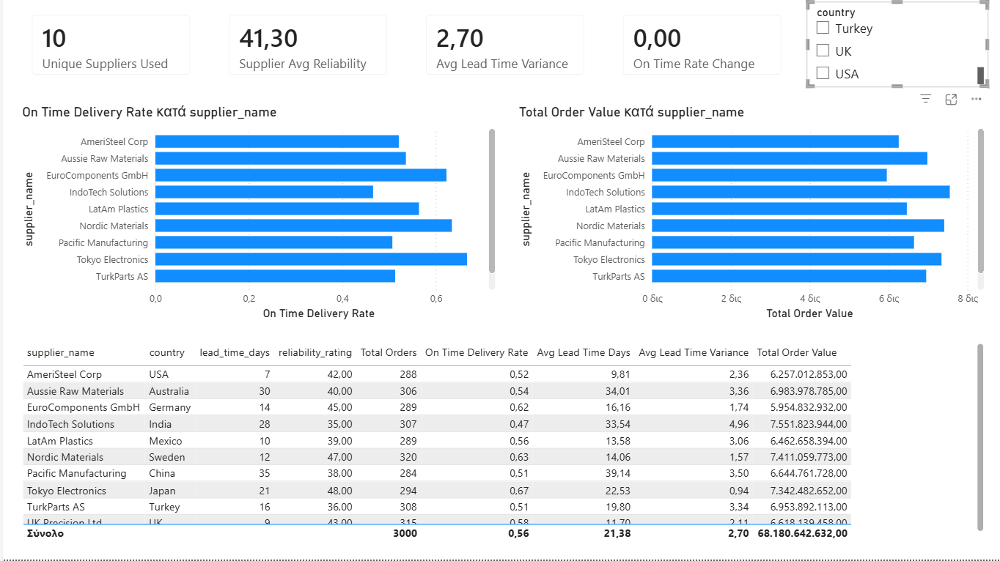
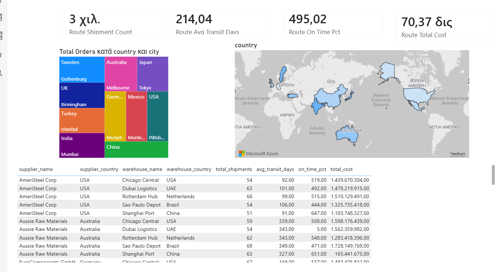
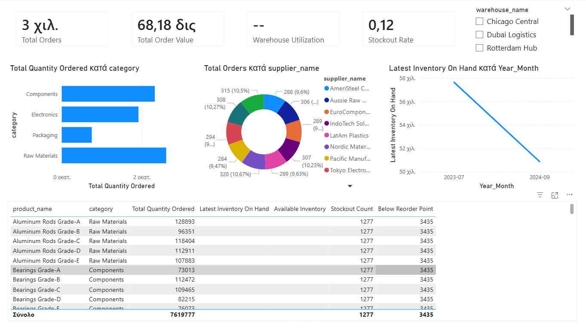
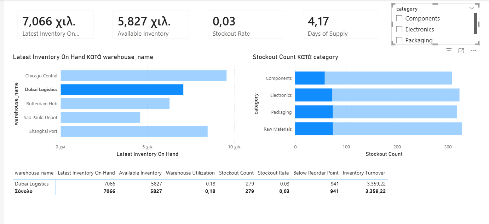

# Power BI Dashboards from Code — Zero Manual UI Work

Build complete, multi-page Power BI dashboards entirely from code. No dragging fields, no clicking through menus.

This repo contains **4 production-ready dashboard projects** built using a code-first workflow that combines:

- **Power BI Modeling MCP Server** for the semantic model (data loading, relationships, DAX measures)
- **PBIR format** (Power BI Enhanced Report) for generating visual layouts as JSON files
- **Python scripts** for automated visual page generation

> **No AI required.** The prompt files in this repo are structured specifications — you can execute them manually in Power BI Desktop, use any MCP-compatible tool, or automate with your own scripts. Claude Desktop / Claude Code is one option, not a requirement.

### Supply Chain Dashboard — Sample Pages


*Page 1: Supply Chain KPIs — cards, line chart with YoY comparison, bar charts, donut, area chart*


*Page 2: Supplier Scorecard — OTD rate & order value bar charts, supplier detail table*


*Page 4: Global Logistics Map — treemap, filled map (choropleth), detail table*


*Page 5: Warehouse Comparison — bar chart, donut, inventory trend line, product detail table*


*Page 3: Inventory Health — inventory by warehouse bar chart, stockout count by category, warehouse matrix*


*Page 6: Advanced Analytics — gauges, scatter plot (lead time vs OTD), waterfall, funnel, ribbon chart*


*Page 7: Visual Showcase — stacked columns, pie chart, 100% stacked bars, clustered column*

## The Workflow

```
                     Phase 0-1                        Phase 2
                  (Semantic Model)                   (Report Layer)

CSV files ──> Power BI Desktop ──> Save .pbip ──> Python Script ──> Open .pbip
              - Load CSVs            (PBIR)       generate_pages.py   (done!)
              - Relationships
              - Calendar table
              - DAX measures
```

### Phase 0-1: Build the Data Model

The prompt files (`*_Dashboard_Prompts.md`) contain all the specifications:
- Table definitions with column names and data types
- Relationship definitions (active/inactive, cardinality, cross-filter direction)
- Calendar table DAX expression
- All DAX measures organized in logical batches

**How to execute Phase 0-1 — pick any method:**

| Method | How |
|--------|-----|
| **Manual** | Open Power BI Desktop, use Get Data for CSVs, create relationships in Model View, type DAX measures in the formula bar. The prompt files tell you exactly what to create. |
| **MCP Server** | Install the [Power BI Modeling MCP](https://marketplace.visualstudio.com/items?itemName=analysis-services.powerbi-modeling-mcp) VS Code extension. Use any MCP-compatible client to send the commands. |
| **MCP + Claude** | Paste the prompts into Claude Desktop (Cowork tab) or Claude Code. Claude executes the MCP commands automatically. |
| **TMDL / Tabular Editor** | Write the model definition directly in TMDL files or use Tabular Editor to script the relationships and measures. |
| **powerbpy** *(alternative)* | Use the Python [powerbpy](https://pypi.org/project/powerbpy/) library to load CSVs and scaffold the `.pbip` structure programmatically. Not used in this project but a viable option for fully scripted pipelines. |

### Phase 2: Generate Visual Pages (Python)

After saving as `.pbip`, run the Python script to generate all pages and visuals:

```bash
python scripts/generate_pages.py
```

Each script writes `visual.json` files into the PBIR folder structure. Every visual is defined as a JSON object specifying:
- Visual type (`cardVisual`, `clusteredBarChart`, `lineChart`, `donutChart`, `tableEx`, `pivotTable`, `slicer`)
- Position and size on the 1280x720 canvas
- Data bindings (which table/column/measure powers the visual)

**This phase is pure Python — no AI, no MCP, no external dependencies.** You can modify the scripts to change layouts, add visuals, or adapt them for your own datasets.

### Phase 3: Open and Polish

Open the `.pbip` file — all pages appear with data-bound visuals. Manual polish (themes, formatting, slicer sync) takes 15-30 minutes vs 2-3 hours of building from scratch.

## The 4 Dashboards

### 1. E-Commerce Sales & Customer Analytics
| Metric | Value |
|--------|-------|
| Tables | 5 (FactSales, FactReturns, DimProduct, DimCustomer, DimStore) |
| Relationships | 6 (4 active + 2 date) |
| DAX Measures | 27 |
| Pages | 4 (Executive Overview, Product Performance, Customer & Trends, Returns Analysis) |
| Key DAX | SUMX with RELATED, USERELATIONSHIP, SAMEPERIODLASTYEAR, DATESINPERIOD |

### 2. Hospital Operations
| Metric | Value |
|--------|-------|
| Tables | 5 (FactAdmissions, FactWaitTimes, DimDepartment, DimDoctor, DimPatient) |
| Relationships | 7 (5 active + 2 date) |
| DAX Measures | 32 |
| Pages | 4 (Hospital Overview, Department Deep-Dive, Wait Time Analysis, Patient Demographics) |
| Key DAX | DATEDIFF, EARLIER (readmission self-join), USERELATIONSHIP, TOTALMTD |

### 3. HR People Analytics
| Metric | Value |
|--------|-------|
| Tables | 5 (FactEmployeeSnapshot, FactRecruitment, DimEmployee, DimDepartment, DimJobLevel) |
| Relationships | 8 (4 active + 4 inactive) |
| DAX Measures | 34 |
| Pages | 4 (Workforce Overview, Attrition Analysis, Compensation & Equity, Recruitment Funnel) |
| Key DAX | LASTDATE snapshot pattern, POWER (annualized rate), RELATED in FILTER, multiple inactive relationships |

### 4. Supply Chain & Inventory
| Metric | Value |
|--------|-------|
| Tables | 6 (FactOrders, FactInventorySnapshot, FactShipmentRoutes, DimProduct, DimSupplier, DimWarehouse) |
| Relationships | 11 (4 active + 7 inactive) |
| DAX Measures | 42 |
| Pages | 5 (Supply Chain KPIs, Supplier Scorecard, Inventory Health, Global Logistics Map, Warehouse Comparison) |
| Key DAX | Multi-fact model, semi-additive LASTDATE, 8x USERELATIONSHIP, DATESINPERIOD rolling window |

## DAX Skills Demonstrated

| Skill | Where Used |
|-------|-----------|
| LASTDATE (snapshot pattern) | HR headcount, Supply Chain inventory |
| USERELATIONSHIP | All projects — inactive relationships for multi-fact models |
| DATEDIFF | Hospital LOS & wait times, HR tenure, Supply Chain lead times |
| EARLIER (self-join) | Hospital 30-day readmission detection |
| SAMEPERIODLASTYEAR | All projects — YoY comparisons |
| TOTALYTD / TOTALMTD | All projects — period-to-date accumulations |
| DATESINPERIOD | E-Commerce L3M/L12M, Supply Chain rolling 3-month |
| SUMX with RELATED | E-Commerce Total Cost (cross-table calculation) |
| POWER function | HR annualized attrition rate |
| SWITCH (RAG colors) | All projects — conditional formatting with hex codes |
| VAR + RETURN | HR Gender Pay Gap |
| DIVIDE (safe division) | All ratio/rate measures across all projects |

## Star Schema Patterns

**Single-Fact (E-Commerce, Hospital, HR):**
```
DimTable1 ──> FactTable <── DimTable2
                  |
              Calendar
```

**Multi-Fact (Supply Chain) — 3 fact tables sharing dimensions:**
```
DimSupplier ──> FactOrders <── DimProduct
                    |              |
               DimWarehouse   (INACTIVE)
                    |              |
               (INACTIVE)   FactInventorySnapshot
                    |
            FactShipmentRoutes (pre-aggregated)
```

## How to Reproduce

### Prerequisites
- Power BI Desktop (with PBIR preview features enabled — see below)
- Python 3.x (for Phase 2 visual generation)

**Optional** (for automated Phase 0-1):
- VS Code with Power BI Modeling MCP extension
- Any MCP-compatible client (Claude Desktop, Claude Code, or your own)

### Enable PBIR in Power BI Desktop
File > Options > Preview features — enable:
- Store reports using enhanced metadata format (PBIR)
- Power BI Project (.pbip) save option
- Store semantic model in TMDL format

### Steps

**Option A: Fully manual**
1. Open Power BI Desktop
2. Load CSVs from a `data/` folder using Get Data > CSV
3. Follow the `*_Dashboard_Prompts.md` file — create relationships, Calendar table, and DAX measures as specified
4. Save as `.pbip` (File > Save As > Power BI Project)
5. Close Power BI Desktop
6. Run `python scripts/generate_pages.py` (update the path inside the script)
7. Reopen the `.pbip` — dashboard ready

**Option B: MCP-assisted**
1. Open a blank Power BI Desktop
2. Paste each phase from `*_Dashboard_Prompts.md` into your MCP client
3. Save as `.pbip` when prompted
4. Close Power BI Desktop
5. Run `python scripts/generate_pages.py`
6. Reopen the `.pbip` — dashboard ready

## Repo Structure

```
powerbi-code-first-dashboards/
  ecommerce/
    data/                          # 5 CSV files (sample data included)
    scripts/generate_pages.py      # PBIR visual generator (pure Python)
    ECommerce_Dashboard_Prompts.md # Full data model specification
  hospital/
    data/                          # 5 CSV files
    scripts/generate_pages.py
    Hospital_Dashboard_Prompts.md
  hr/
    data/                          # 5 CSV files
    scripts/generate_pages.py
    HR_Dashboard_Prompts.md
  supply_chain/
    data/                          # 6 CSV files
    scripts/generate_pages.py
    SupplyChain_Dashboard_Prompts.md
  workflow/
    PowerBI_From_Code_Workflow.md   # Detailed methodology guide
```

## Why Code-First?

- **Reproducible** — the entire pipeline is text-based and version-controllable
- **Fast** — 4 complete dashboards built in under an hour vs days of manual work
- **Consistent** — same layout patterns, naming conventions, and measure structures
- **Learnable** — each prompt file is a self-contained DAX tutorial with all measures spelled out
- **Portable** — `.pbip` folders are just text files (JSON + TMDL), no binary `.pbix` blobs

## Reuse This for Your Own Data

You can adapt this workflow for any dataset. Here's how:

### 1. Prepare Your Data
- Organize your data as CSVs with clear naming: `FactXxx` for transactional data, `DimXxx` for lookup/dimension tables
- Include ID columns for relationships (e.g., `product_id`, `customer_id`)
- Include at least one date column for time intelligence

### 2. Write Your Prompt File
Copy any `*_Dashboard_Prompts.md` as a template and modify:
- **Phase 0**: List your CSV files with column names and data types
- **Phase 1A**: Define relationships between your tables (which ID connects what)
- **Phase 1B**: Add a Calendar table (the DAX expression is reusable as-is — just change the date range)
- **Phase 1C-H**: Write your DAX measures. Start with simple aggregations (`SUM`, `COUNT`, `AVERAGE`), then add time intelligence (`SAMEPERIODLASTYEAR`, `TOTALYTD`), then ratios (`DIVIDE`)

### 3. Adapt the Python Script
Copy any `generate_pages.py` and modify the page definitions:
- Change `BASE` path to point to your `.pbip` report folder
- Define pages using the helper functions (`make_card`, `make_clustered_bar`, `make_line_chart`, `make_table`, etc.)
- Use your own table/column/measure names in the function calls
- All visuals are positioned on a **1280x720 canvas** — adjust `x`, `y`, `w`, `h` values to lay out your dashboard

### 4. Available Visual Types
| Function | Visual Type | Required Fields |
|----------|------------|----------------|
| `make_card` | KPI card | 1 measure |
| `make_clustered_bar` | Horizontal bar chart | 1 category + 1 measure |
| `make_clustered_column` | Vertical bar chart | 1 category + 1 measure |
| `make_line_chart` | Line chart (supports 2 lines) | 1 category + 1-2 measures |
| `make_area_chart` | Area chart | 1 category + 1 measure |
| `make_donut` | Donut chart | 1 category + 1 measure |
| `make_pie` | Pie chart | 1 category + 1 measure |
| `make_table` | Flat table | Any mix of columns + measures |
| `make_matrix` | Pivot table | Row fields + value measures |
| `make_treemap` | Treemap | 1 category + 1 measure (+ optional group) |
| `make_filled_map` | Choropleth map | 1 location column + 1 measure |
| `make_gauge` | Gauge | 1 value measure (+ optional target/min/max) |
| `make_waterfall` | Waterfall chart | 1 category + 1 measure |
| `make_funnel` | Funnel chart | 1 category + 1 measure |
| `make_scatter` | Scatter plot | 1 detail column + 2 measures (+ optional size) |
| `make_ribbon` | Ribbon chart | 1 category + 1 series + 1 measure |
| `make_slicer` | Filter slicer | 1 column |

### 5. Quick Start Example
```python
# Your custom page
p1 = [
    make_card("revenue", 20, 10, 295, 110, "_Measures", "Total Revenue"),
    make_card("customers", 330, 10, 295, 110, "_Measures", "Customer Count"),
    make_line_chart("trend", 20, 140, 610, 280, "Calendar", "Year_Month", "_Measures", "Total Revenue"),
    make_clustered_bar("by_region", 650, 140, 600, 280, "DimRegion", "region_name", "_Measures", "Total Revenue"),
    make_table("details", 20, 440, 1230, 260, [
        ("DimProduct", "product_name", False),    # False = column
        ("_Measures", "Total Revenue", True),       # True = measure
        ("_Measures", "Quantity Sold", True),
    ]),
]
write_page(uid("my_page1"), "Sales Overview", p1)
```

## Tech Stack

| Component | Role | Required? |
|-----------|------|-----------|
| Power BI Desktop | Runtime engine | Yes |
| PBIR (JSON) | Visual layout definition | Yes (enabled via preview features) |
| Python | Visual page generation scripts | Yes (Phase 2) |
| Power BI Modeling MCP | Automated data model creation | Optional (Phase 0-1 can be done manually) |
| MCP client (Claude, etc.) | Orchestration layer | Optional |

---

*The `.pbip` format and PBIR visual definitions became production-ready in early 2026. This workflow leverages Power BI's shift toward text-based, developer-friendly project files.*
