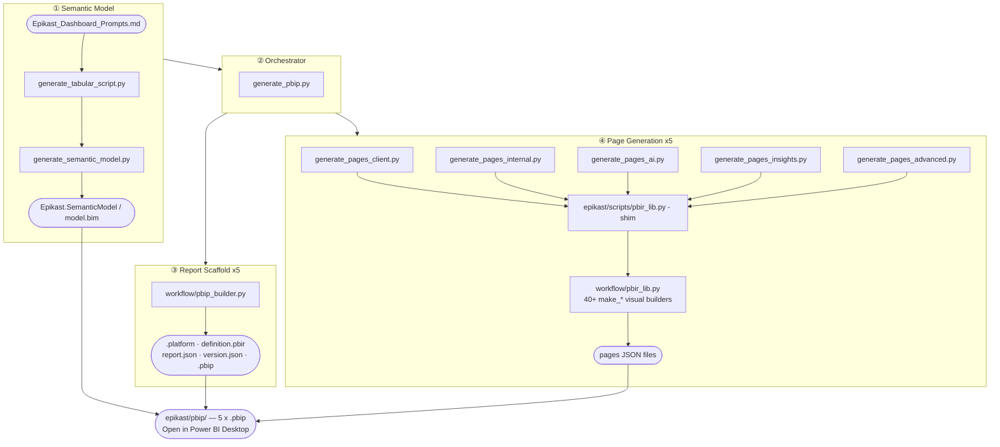

# Epikast Build Flow

How one command (`generate_pbip.py`) produces five openable Power BI reports from a single prompt file.



---

## What each stage does

### ① Semantic Model — the data + DAX layer

| Script | Input | Output | What it does |
|--------|-------|--------|--------------|
| `generate_tabular_script.py` | `Epikast_Dashboard_Prompts.md` | DAX dict in memory | Parses every measure block from the prompt file. Skips DAX keywords (`VAR`, `RETURN`) so they are not mistaken for measure names. |
| `generate_semantic_model.py` | DAX dict + CSV schema | `model.bim` | Writes a full TMSL JSON file: 15 tables, M partitions that load CSVs via the `SourceFolder` parameter, 15 relationships, 137 DAX measures with unique `lineageTag` GUIDs, 6 calculated columns. |

**model.bim contains:**
- `SourceFolder` — M parameter pointing at `epikast/data/`; set this on first open
- All fact + dim tables with typed columns
- Calendar table (Date, Year, Month, Quarter, Year_Month, Year_Quarter)
- `_Measures` table — all 137 DAX measures

---

### ② Orchestrator — the single entry point

`generate_pbip.py` drives the whole build in sequence:

```
1. run generate_semantic_model.py  → Epikast.SemanticModel/model.bim
2. for each of 5 reports:
   a. pbip_builder.scaffold_report()  → folder structure + schema files
   b. subprocess: generate_pages_*.py → pages/*.json
```

All output lands in `epikast/pbip/` (or `--root=` path).

---

### ③ Report Scaffold — Power BI Desktop file structure

`workflow/pbip_builder.py` writes four files per report, matching **Power BI Desktop June 2026+** requirements:

| File | Purpose |
|------|---------|
| `.platform` | Identifies the folder as a Report artifact; contains a deterministic `logicalId` GUID |
| `definition.pbir` | Points the report at the shared model via relative path `../Epikast.SemanticModel` |
| `definition/report.json` | Schema 3.2.0, `CY26SU02` base theme, report-level settings. Required for save without NullReferenceException. |
| `definition/version.json` | Schema version metadata. Required by June 2026+; missing file causes load error. |
| `<report>.pbip` | The file you double-click; lists the Report artifact path. |

All five reports share **one** semantic model folder.

---

### ④ Page Generation — the visual layer

Each `generate_pages_*.py` script defines pages as Python lists of visual dicts, then calls `write_page()`.

**How imports work:**

```
generate_pages_client.py
    import pbir_lib as pb          ← resolves to epikast/scripts/pbir_lib.py (shim)
         └── loads workflow/pbir_lib.py by absolute path
              └── all make_* functions live here
```

The shim exists so the five scripts need no path manipulation — they just `import pbir_lib` as if it were local.

**Visual builders available (`workflow/pbir_lib.py`):**

| Category | Functions |
|----------|-----------|
| KPI | `make_card`, `make_multi_card`, `make_gauge` |
| Bar / Column | `make_clustered_bar/column`, `*_multi`, `*_gradient`, `make_measure_bar/column`, `make_stacked_*`, `make_hundred_pct_stacked_*`, `make_ribbon`, `make_waterfall`, `make_funnel` |
| Line / Area | `make_line_chart` (up to 3 measures + reference line), `make_area_chart`, `make_combo_chart` |
| Pie / Scatter | `make_donut`, `make_pie`, `make_scatter`, `make_treemap` |
| Table / Matrix | `make_table`, `make_matrix`, `make_matrix_heatmap` |
| Map | `make_filled_map`, `make_map` |
| AI visuals | `make_key_influencers`, `make_decomposition_tree` (wire fields manually on first open) |
| UI | `make_slicer`, `make_title_bar`, `make_button` |
| Script | `make_r_visual`, `make_py_visual` |
| Background | `make_background`, `write_background` (optional Pillow dependency) |

**Canvas:** all pages are **1280 × 720 px**
Standard layout: cards `y=10 h=110`, charts `y=140 h=280`, tables `y=440 h=260`

---

### Output — the five reports

| Report | Script | Audience |
|--------|--------|----------|
| `epikast_client_dashb.pbip` | `generate_pages_client.py` | Biopharma client — value story, no internal detail |
| `epikast_internal_dashb.pbip` | `generate_pages_internal.py` | Internal ops team — rep performance, compliance |
| `epikast_ai_dashb.pbip` | `generate_pages_ai.py` | AI effectiveness — targeting, A/B experiments |
| `epikast_insights_dashb.pbip` | `generate_pages_insights.py` | Market & patient insights |
| `epikast_advanced_dashb.pbip` | `generate_pages_advanced.py` | Advanced analytics — heatmaps, decomposition, R visuals |

All five point at the same `Epikast.SemanticModel/model.bim` — one data model, five lenses.

---

## File map

```
epikast/
  Epikast_Dashboard_Prompts.md        ← edit this to change data model or measures
  scripts/
    generate_pbip.py                  ← RUN THIS to build everything
    generate_tabular_script.py        ← DAX parser
    generate_semantic_model.py        ← model.bim writer
    generate_pages_client.py          ← page layouts (5 files)
    generate_pages_internal.py
    generate_pages_ai.py
    generate_pages_insights.py
    generate_pages_advanced.py
    pbir_lib.py                       ← shim → workflow/pbir_lib.py
  pbip/                               ← BUILD OUTPUT (git-tracked)
    Epikast.SemanticModel/
      model.bim
    epikast_client_dashb.Report/
    epikast_internal_dashb.Report/
    epikast_ai_dashb.Report/
    epikast_insights_dashb.Report/
    epikast_advanced_dashb.Report/
    *.pbip  (x5)

workflow/
  pbir_lib.py                         ← shared visual builder library
  pbip_builder.py                     ← shared PBIP scaffold library
  EPIKAST_BUILD_FLOW.md               ← this file
```

---

## To rebuild

```bash
# from repo root — rebuilds model + all 5 reports
python epikast/scripts/generate_pbip.py

# output to a custom folder
python epikast/scripts/generate_pbip.py --root="C:/Users/me/Documents/epikast_pbip"

# point data at a different CSV folder
python epikast/scripts/generate_pbip.py --data="C:/data/epikast"
```

**First open checklist:**
1. Open any `.pbip` in Power BI Desktop (Windows, June 2026+)
2. **Transform data → Manage parameters → SourceFolder** → set to your `epikast/data/` path
3. **Home → Refresh**
4. AI visuals (Key Influencers, Decomposition Tree) need fields wired manually — drag from the field pane into Analyze / Explain by

**Constraints:**
- Power BI Desktop must be **closed** when running `generate_pbip.py` (it locks the files)
- Table and measure names are **case-sensitive** — must match `model.bim` exactly
- Do not manually edit files inside `.Report/` — rerun the script instead
